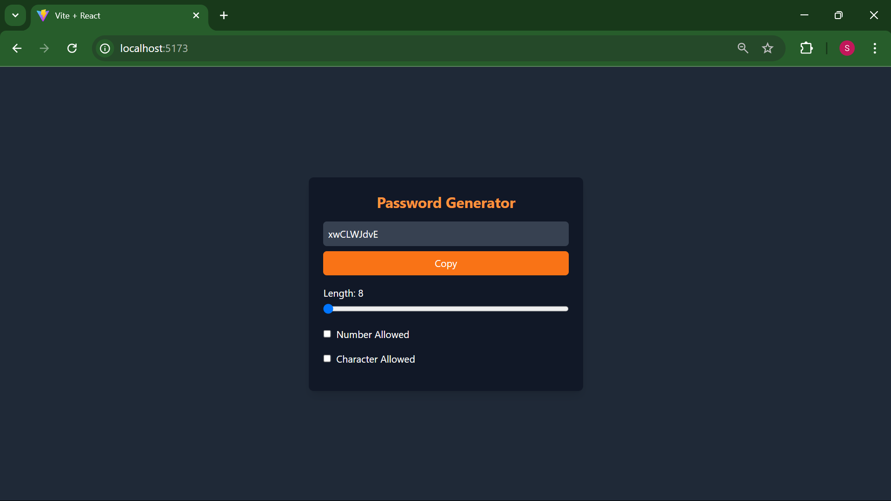

# passwordGenerator 

Here is an example of my project:



# Understanding React Hooks

React Hooks are functions that let you use state and other React features without writing a class. Here’s a brief overview of some commonly used hooks:

## 1. `useState`

The `useState` hook allows you to add state to functional components. It returns a state variable and a function to update that variable. When the state changes, the component re-renders to reflect the new state.

### Example:
```javascript
import React, { useState } from 'react';

function Counter() {
    const [count, setCount] = useState(0);

    return (
        <div>
            <p>You clicked {count} times</p>
            <button onClick={() => setCount(count + 1)}>
                Click me
            </button>
        </div>
    );
}
```
## 2. `useEffect`
The `useEffect` hook allows you to perform side effects in your components, such as data fetching, subscriptions, or manually changing the DOM. It runs after the first render and after every update, unless you specify dependencies.
### Example:
```javascript
import React, { useEffect, useState } from 'react';

function DataFetcher() {
    const [data, setData] = useState(null);

    useEffect(() => {
        fetch('https://api.example.com/data')
            .then(response => response.json())
            .then(data => setData(data));
    }, []); // Empty array means it runs once after the initial render

    return <div>{data ? JSON.stringify(data) : 'Loading...'}</div>;
}
```
## 3. `useCallBack`
### Example:
```javascript
import React, { useCallback, useState } from 'react';

function ParentComponent() {
    const [count, setCount] = useState(0);

    const increment = useCallback(() => {
        setCount(c => c + 1);
    }, []); // Memoized function

    return <ChildComponent onClick={increment} />;
}

function ChildComponent({ onClick }) {
    return <button onClick={onClick}>Increment</button>;
}
```
## 4. `useRef`
The useRef hook allows you to create a mutable object that persists for the full lifetime of the component. It can be used to directly interact with the DOM, such as focusing an input field or storing a previous va

import React, { useRef } from 'react';

###Example:
```javascript
function TextInput() {
    const inputRef = useRef(null);

    const focusInput = () => {
        inputRef.current.focus();
    };

    return (
        <div>
            <input ref={inputRef} type="text" />
            <button onClick={focusInput}>Focus Input</button>
        </div>
    );
}
```
